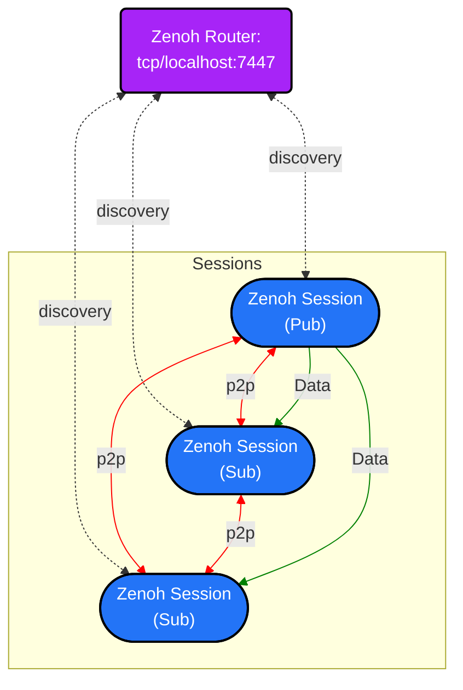

# Design

## Introduction

`rmw_zenoh_cpp` maps the ROS 2 [RMW API](https://github.com/ros2/rmw/tree/rolling/rmw/include/rmw) as of late 2023 onto Zenoh APIs, using [zenoh-c](https://github.com/eclipse-zenoh/zenoh-c).

The end result is that users can use ROS 2 to send and receive data over Zenoh, using the APIs that they are already familiar with.

> 最终结果是，用户可以使用他们已经熟悉的 API 使用 ROS 2 通过 ZENOH 发送和接收数据。

## Brief overview

There is more detail on each item below, but a brief overview on how this is accomplished is the following:

> 下面的每个项目都有更多详细信息，但是有关如何完成的简要概述如下：

- It is assumed that a Zenoh router is running on the local system. This router will be used for discovery and host-to-host communication. However it is _not_ used for intra-host comms (i.e., as a message broker); that is done via direct peer-to-peer connections.

> - 假定 Zenoh 路由器在本地系统上运行。该路由器将用于发现和主机到主机通信。但是，它是*not*用于主持人内通信(即作为消息代理)；这是通过直接对等连接完成的。

- Each "context" in ROS 2 is mapped to a single Zenoh "session". That means that there may be many publishers, subscriptions, services, and clients sharing the same session.

> - ROS 2 中的每个“上下文”都映射到一个 Zenoh“ Session”。这意味着可能有许多出版商，订阅，服务和客户共享同一会话。

- Every "context" has a local "graph cache" that keeps track of the details of the network graph of ROS 2 entities.

> - 每个“上下文”都有一个本地的“图表缓存”，可跟踪 ROS 2 实体网络图的详细信息。

- Zenoh publishers, subscriptions, services, and clients are created or destroyed when the corresponding RMW APIs are called.

> -ZENOH Publishers，订阅，服务和客户端将在调用相应的 RMW API 时创建或破坏。

- Data is sent and received through the appropriate zenoh-c API when the corresponding RMW APIs are called.

> - 当调用相应的 RMW API 时，通过适当的 ZENOH-C API 发送并接收数据。

The following diagram shows the default network topology of a subsystem composed of 3 nodes:

> 下图显示了由 3 个节点组成的子系统的默认网络拓扑：

Default Configuration for Zenoh Sessions:
| Config | Zenoh Session | Zenoh Router |
| :---: | :---: | :---: |
| Mode | Peer | Router |
| Connect | tcp/localhost:7447 | - |
| UDP Multicast | Disabled | Disabled |
| Gossip Scouting | Enabled | Enabled |

## Router

Zenoh has the ability to do discovery using local multicast announcements. However, local multicast has some limitations, both intrinsic and specific to Zenoh:

- Multicast discovery can cause a lot of discovery traffic while discovering all other entities in the graph.
- Multicast discovery has a limited TTL (time-to-live), which means it can usually only discover peers on the local network segment.

> Zenoh 具有使用本地多播公告进行发现的能力。
> 但是，局部多播具有一些局限性和特定于 Zenoh 的局限性：
>
> - 多播发现可能会导致大量发现流量，同时发现图中的所有其他实体。
> - 多播 Discovery 具有有限的 TTL(直播时间)，这意味着它通常只能在本地网络段上发现同行。

To alleviate issues with multicast discovery, `rmw_zenoh_cpp` relies on a Zenoh router to discover peers and forward this discovery information to other peers via Zenoh's `gossip scouting` functionality.

> 为了减轻多播发现的问题，`rmw_zenoh_cpp`依靠 Zenoh 路由器来发现同行并通过 Zenoh 的“八卦侦察”功能将这些发现信息转发给其他同行。
> Hence `rmw_zenoh_cpp` requires the Zenoh router to be running.

It should be noted that when building upstream Zenoh from source, a `zenohd` binary is created which is the router.

> 应当指出的是，当从源上构建上游 Zenoh 时，创建了“ Zenohd”二进制文件，这是路由器。
> `rmw_zenoh_cpp` has its own simplified version of the router that nonetheless uses most of the same code.

This was done so that Zenoh didn't have to be vendored twice (once for zenoh-c and once for zenohd), and so that the router could be more easily integrated into the ROS 2 package format.

> 这样做是为了使 Zenoh 不必两次供应商(一次是 Zenoh-C，一次用于 Zenohd)，因此可以更容易地将路由器集成到 ROS 2 包装格式中。

As of 2024-02-09, the user is expected to launch the router by hand.

In order to integrate more seamlessly into ROS 2, the Zenoh router can be launched by running `ros2 run rmw_zenoh_cpp rmw_zenohd`.

> 为了使更无缝地集成到 ROS 2 中，可以通过运行`ros2运行rmw_zenoh_cpp rmw_zenohd`来启动 ZENOH 路由器。

The default configuration that the router uses is located in [DEFAULT_RMW_ZENOH_ROUTER_CONFIG.json5](../rmw_zenoh_cpp/config/DEFAULT_RMW_ZENOH_ROUTER_CONFIG.json5).

> 路由器使用的默认配置位于[default_rmw_zenoh_router_config.json5](../ rmw_zenoh_cpp/config/config//default_rmw_rmw_zenoh_router_router_config.json5)中。

The user can use a custom configuration by setting the `ZENOH_ROUTER_CONFIG_URI` environment variable to point to a valid [Zenoh configuration file](https://github.com/eclipse-zenoh/zenoh/blob/main/DEFAULT_CONFIG.json5).

> 用户可以通过设置`zenoh_router_config_uri`环境变量来使用自定义配置，以指向有效的[zenoh 配置文件](https://github.com/eclipse-zenoh/zenoh/zenoh/zenoh/blob/blob/main/main/default_config.json5)。

In the future, additional work may be done to automatically launch a Zenoh router if one isn't already running.

> 将来，如果尚未运行的话，可以自动启动 ZENOH 路由器的其他工作。

## Serialization/Deserialization

By default, Zenoh doesn't specify a serialization format; it just delivers bags of bytes.

> 默认情况下，Zenoh 未指定序列化格式；它只是提供字母袋。

There are quite a few serialization formats that `rmw_zenoh_cpp` could use, including protobuf, CDR, Cap'n Proto, JSON, etc.

> `rmw_zenoh_cpp 都可以使用很多序列化格式，包括 Protobuf，Cdr，Cap'n Proto，JSON，等。

In the current design, `rmw_zenoh_cpp` uses CDR as the serialization format for the following reasons:

> 在当前设计中，`rmw_zenoh_cpp`使用 CDR 作为序列化格式，其原因是：

- Using CDR means that data can be bridged between Zenoh and DDS without a deserialization/serialization step.
- Using CDR means that a new typesupport doesn't have to be developed, which is its own project.

> - 使用 CDR 意味着可以在 ZENOH 和 DD 之间桥接数据，而无需进行反序列化/序列化步骤。

### Related RMW APIs

- rmw_get_serialized_message_size
- rmw_serialize
- rmw_deserialize

### Related Zenoh-c APIs

N/A

## Graph Cache

One of the biggest impedance mismatches between Zenoh and ROS 2 has to do with graph introspection.

> Zenoh 和 Ros 2 之间最大的阻抗不匹配之一与图形内省有关。

Zenoh attempts to do the absolute minimum of discovery (for performance reasons), while ROS 2 generally assumes that the entire graph is available from all entities in the system (for debugging/introspection reasons).

> Zenoh 试图执行发现的绝对最小值(出于性能原因)，而 ROS 2 通常假设整个图都可以从系统中的所有实体中获得(出于调试/内省原因)。

To deal with this discrepancy, each context in `rmw_zenoh_cpp` keeps a cache of all entities discovered in the graph so far.

> 为了处理这种差异，“ rmw_zenoh_cpp”中的每个上下文都可以使迄今为止在图中发现的所有实体的缓存。

An "entity" is a node, publisher, subscription, service server, or service client.

> “实体”是节点，发布者，订阅，服务服务器或服务客户端。

Each entity sends a unique liveliness token as it comes online, and removes that liveliness token when it is destroyed.

> 每个实体在上网时都会发送一个独特的活泼代币，并在被摧毁时消除了活泼的代币。

The key expression of these liveliness tokens encode information about the entity and it's relationship to the other entities in the system (for instance, a publisher is always attached to a node within a certain namespace).

> 这些活泼代币的关键表达式编码有关该实体及其与系统中其他实体的关系的信息(例如，发布者始终将其附加到某个名称空间中的节点上)。
> The format of a liveliness token is:

`<ADMIN_SPACE>/<domainid>/<id>/<entity>/<namespace>/<nodename>`

Where:

- `<domainid>` - A number set by the user to "partition" graphs. Roughly equivalent to the domain ID in DDS.
- `<id>` - A unique ID to identify this entity. Currently the id is the zenoh session's id with elements concatenated into a string using '.' as separator.
- `<entity>` - The type of entity. This can be one of "NN" for a node, "MP" for a publisher, "MS" for a subscription, "SS" for a service server, or "SC" for a service client.
- `<namespace>` - The ROS namespace for this entity.
- `<nodename>` - The ROS node name for this entity.

> - `<DomainId>` - 用户设置的数字用于“分区”图。大致等于 DDS 中的域 ID。
> - `<id>` - 识别此实体的唯一 ID。当前，ID 是 Zenoh Session 的 ID，其元素使用“使用”。作为分离器。
> - `<entity>` - 实体的类型。对于出版商而言，这可能是节点的“ NN”之一，用于订阅的“ MP”，对于服务服务器的“ SS”或服务客户端的“ SS”。

During context initialization, `rmw_zenoh_cpp` calls `zc_liveliness_get` to get an initial view of the entire graph from other nodes in the system.

> 在上下文初始化期间，`rmw_zenoh_cpp调用`zc_liveliness_get`以从系统中的其他节点获取整个图的初始视图。

From then on, when entities enter and leave the system, `rmw_zenoh_cpp` will get new liveliness tokens that it can use to update its internal cache.

> 从那时起，当实体输入并离开系统时，`rmw_zenoh_cpp`将获得新的活泼令牌，可以用来更新其内部缓存。

### Related RMW APIs

- rmw_publisher_count_matched_subscriptions
- rmw_subscription_count_matched_publishers
- rmw_get_node_names
- rmw_get_node_names_with_enclaves
- rmw_count_publishers
- rmw_count_subscribers
- rmw_count_clients
- rmw_count_services
- rmw_get_gid_for_publisher
- rmw_get_gid_for_client
- rmw_compare_gids_equal
- rmw_get_service_names_and_types
- rmw_get_publishers_info_by_topic
- rmw_get_subscriptions_info_by_topic
- rmw_get_subscriber_names_and_types_by_node
- rmw_get_publisher_names_and_types_by_node
- rmw_get_service_names_and_types_by_node
- rmw_get_client_names_and_types_by_node
- rmw_get_topic_names_and_types

### Related Zenoh-c APIs

- zc_liveliness_declare_token
- zc_liveliness_declare_subscriber
- zc_liveliness_get

## Contexts

A ROS 2 context describes a certain middleware configuration, which can contain 0 or more ROS 2 nodes.

> ROS 2 上下文描述了某些中间件配置，该配置可以包含 0 或更多 ROS 2 节点。

In `rmw_zenoh_cpp`, a context maps to a Zenoh session, along with a liveliness token for the graph cache and some additional metadata.

> 在“ rmw_zenoh_cpp”中，上下文映射到 zenoh 会话，以及用于图表缓存的活泼令牌和一些其他元数据。

Zenoh allows sessions to be custom configured through a configuration file.

> Zenoh 允许通过配置文件自定义会话。

If otherwise unconfigured, `rmw_zenoh_cpp` uses a [default configuration file](../rmw_zenoh_cpp/config/DEFAULT_RMW_ZENOH_SESSION_CONFIG.json5).

> 如果其他未配置，则`rmw_zenoh_cpp`使用[默认配置文件](../ rmw_zenoh_cpp/config/config/default_rmw_zenoh_session_config.json5)。

The user can use a custom configuration by setting the `ZENOH_SESSION_CONFIG_URI` environment variable to point to a valid [Zenoh configuration file](https://github.com/eclipse-zenoh/zenoh/blob/main/DEFAULT_CONFIG.json5).

> 用户可以通过设置`zenoh_session_config_uri`环境变量来使用自定义配置，以指向有效的[zenoh 配置文件](https://github.com/eclipse-zenoh/zenoh/zenoh/zenoh/blob/main/main/main/main/defeault_config.json5)。

### Related RMW APIs

- rmw_get_zero_initialized_init_options
- rmw_init_options_copy
- rmw_init_options_fini
- rmw_get_zero_initialized_context
- rmw_init
- rmw_shutdown
- rmw_context_init
- rmw_create_guard_condition
- rmw_destroy_guard_condition
- rmw_trigger_guard_condition
- rmw_create_wait_set
- rmw_destroy_wait_set
- rmw_wait

### Related Zenoh-c APIs

- zc_liveliness_declare_subscriber
- zc_liveliness_get
- z_open
- z_close
- z_undeclare_subscriber
- z_call
- z_session_check

## Namespaces

ROS 2 has a concept of "namespaces", where everything under that namespace has an additional prefix added to all names.

> ROS 2 具有“命名空间”的概念，其中该名称空间下的所有内容都在所有名称中添加了附加前缀。
> Because of this, namespaces are not separate "entities" in a ROS 2 graph.

Zenoh doesn't directly have a concept of a namespace; instead, everything is under a single global namespace, but can be partitioned by using `/` in topic and queryable names.

> Zenoh 没有直接的命名空间概念。取而代之的是，所有内容都属于一个全局名称空间，但可以通过在主题和可查询名称中使用`/`来分区。

To map the ROS 2 concept of namespaces onto Zenoh, all entity liveliness tokens encode the namespace.

> 要将命名空间的 ROS 2 概念映射到 Zenoh，所有实体活泼代币都编码了名称空间。

Since Zenoh liveliness tokens cannot be empty, in the case of an empty namespace (the default), a namespace of `%` is used.

> 由于 Zenoh 生动代币不能为空名称空间(默认名称)(默认名称)，因此使用``％''的名称空间。

## Nodes

A ROS 2 node can be though of as the "unit of computation" in a ROS 2 graph; usually one node performs one particular task.

> ROS 2 节点可以作为 ROS 2 图中的“计算单位”。通常，一个节点执行一个特定的任务。

Nodes may contain publishers, subscriptions, service servers, service clients, action servers, action clients, parameters, and anything else needed to do some computation.

> 节点可能包含发布者，订阅，服务服务器，服务客户端，操作服务器，操作客户端，参数以及进行某些计算所需的其他任何内容。

Zenoh has no conceptual equivalent to the ROS 2 node, so `rmw_zenoh_cpp` creates no Zenoh entities when nodes are created.

> Zenoh 与 ROS 2 节点没有概念上的等效，因此创建节点时没有创建 Zenoh 实体。

When a new node is created through the RMW API, a liveliness token of type `NN` is sent out.

> 当通过 RMW API 创建新节点时，发送了“ NN”类型的活泼令牌。

### Related RMW APIs

- rmw_create_node
- rmw_destroy_node
- rmw_node_get_graph_guard_condition

### Related Zenoh-c APIs

- zc_liveliness_declare_token

## Publishers

A ROS 2 publisher sends data to 0 or more connected subscriptions.

A Zenoh publisher does exactly the same thing, so ROS 2 publishers are mapped onto Zenoh publishers in `rmw_zenoh_cpp`.

> Zenoh Publisher 做的完全相同，因此 ROS 2 发布者在`rmw_zenoh_cpp`中映射到 Zenoh Publishers。

If the Quality of Service durability for a publisher is `TRANSIENT_LOCAL`, a Zenoh publication cache will also be created with `ze_declare_publication_cache`.

> 如果发布者的服务耐用性质量为`transient_local`，ZENOH Publication Cache 也将使用`Ze_declare_publication_cache“ Cache”创建。

See the [Quality of Service](#Quality-of-Service) section below for more information.

> 有关更多信息，请参见下面的[服务质量](＃服务质量)部分。

When a new publisher is created, a liveliness token of type `MP` is sent out.

> 创建新的发布者时，发送了“ MP”类型的活泼标记。

### Related RMW APIs

- rmw_create_publisher
- rmw_destroy_publisher
- rmw_publish
- rmw_publish_serialized_message
- rmw_borrow_loaned_message
- rmw_return_loaned_message
- rmw_publisher_wait_for_all_acked
- rmw_publisher_get_network_flow_endpoints
- rmw_publisher_event_init

### Related Zenoh-c APIs

- zc_liveliness_declare_token
- zc_publish_put_owned
- ze_declare_publication_cache
- z_declare_publisher
- z_undeclare_publisher
- z_publisher_put

## Subscriptions

A ROS 2 subscription receives data from 1 or more connected publishers.

A Zenoh subscriber does exactly the same thing, so ROS 2 subscriptions are mapped onto Zenoh subscribers in `rmw_zenoh_cpp`.

> Zenoh 订户做的事情完全相同，因此 ROS 2 订阅被映射到'rmw_zenoh_cpp`中的 zenoh 订阅者。

If the Quality of Service durability for a subscription is `TRANSIENT_LOCAL`, a Zenoh `ze_owned_querying_subscriber_t` will be created; in all other cases, a `z_owned_subscriber_t` will be created.

> 如果订阅的服务耐用性质量为`transient_local“，则将创建zenoh ze_owned_querying_subscriber_t`；在所有其他情况下，都会创建一个`z_owned_subscriber_t`。

See the [Quality of Service](#Quality-of-Service) section below for more information.

> 有关更多信息，请参见下面的[服务质量](＃服务质量)部分。

When new data arrives, a callback within `rmw_zenoh_cpp` is executed, which takes ownership of the data and signals that there is data available.

> 当新数据到达时，执行`rmw_zenoh_cpp`中的回调了，该回调获得了可用数据的数据和信号。

Then rmw_wait can find out that there is data available, and the data can be delivered via rmw_take.

> 然后，RMW_WAIT 可以发现有可用的数据，并且可以通过 RMW_Take 传递数据。

When a new subscription is created, a liveliness token of type `MS` is sent out.

> 创建新订阅时，发送了“ MS”类型的活泼令牌。

### Related RMW APIs

- rmw_create_subscription
- rmw_destroy_subscription
- rmw_take
- rmw_take_with_info
- rmw_take_sequence
- rmw_take_serialized_message
- rmw_take_serialized_message_with_info
- rmw_wait
- rmw_subscription_set_on_new_request_callback
- rmw_subscription_set_content_filter
- rmw_subscription_get_content_filter
- rmw_take_loaned_message
- rmw_take_loaned_message_with_info
- rmw_return_loaned_message_from_subscription
- rmw_subscription_get_network_flow_endpoints
- rmw_subscription_event_init

### Related Zenoh-c APIs

- zc_liveliness_declare_token
- zc_sample_payload_rcinc
- ze_declare_querying_subscriber
- z_declare_subscriber
- z_undeclare_subscriber

## Service Clients

In ROS 2, services are meant to be used for remote procedure calls that will return fairly quickly.

> 在 ROS 2 中，服务将用于将很快返回的远程过程调用。
> `rmw_zenoh_cpp` uses Zenoh queryables to implement ROS 2 services.

When a client wants to make a request, it uses the rmw API `rmw_send_request`.

> 当客户端想要提出请求时，它使用 RMW API“ RMW_SEND_REQUEST”。

Attached to that request are various other pieces of metadata, like the sequence number of the request and the GUID of the client that sent the request.

> 该请求附带的是其他各种元数据，例如请求的序列编号和发送请求的客户端的 GUID。

The sequence number is used to correlate this request to the response that comes back later.

> 序列编号用于将此请求与以后返回的响应相关联。
> `rmw_zenoh_cpp` then calls the Zenoh `z_get` function to send a query out to the network.

Assuming there is a service server listening to that queryable, it will receive the request, perform a computation, and return the result.

> 假设有一个服务服务器收听该查询，它将接收请求，执行计算并返回结果。

The result will then be made available to the client via `rmw_take_response`.

> 然后，将通过`rmw_take_response“将结果提供给客户端。

When a new service client is created, a liveliness token of type `SC` is sent out.

> 创建新的服务客户端时，发送了“ SC”类型的活泼标记。

### Related RMW APIs

- rmw_create_client
- rmw_destroy_client
- rmw_send_request
- rwm_take_response
- rmw_take
- rmw_take_with_info
- rmw_take_sequence
- rmw_take_serialized_message
- rmw_take_serialized_message_with_info
- rmw_wait
- rmw_service_server_is_available
- rmw_client_set_on_new_response_callback

### Related Zenoh-c APIs

- zc_liveliness_declare_token
- z_get
- z_attachment_get

## Service Servers

In ROS 2, services are meant to be used for remote procedure calls that will return fairly quickly.

> 在 ROS 2 中，服务将用于将很快返回的远程过程调用。
> `rmw_zenoh_cpp` uses Zenoh queryables to implement ROS 2 services.

When a ROS 2 node wants to advertise a service to the network, it calls `rmw_create_service`.

> 当 ROS 2 节点想为网络做广告时，它将称为“ rmw_create_service”。
> `rmw_zenoh_cpp` uses the `z_declare_queryable` Zenoh API to create that service.

When a client request comes in, `rmw_take_request` is called to send the query to the user callback, which should perform some computation.

> 客户请求进来时，``rmw_take_request`被调用将查询发送给用户回调，该查询应该执行一些计算。

Once the user callback returns, `rmw_send_response` is called to send the response back to the requester.

> 用户回调返回后，`rmw_send_response`被调用以将响应发送给请求者。

When a new service server is created, a liveliness token of type `SS` is sent out.

> 当创建新的服务服务器时，发送了“ SS”类型的活泼令牌。

### Related RMW APIs

- rmw_create_service
- rmw_destroy_service
- rmw_take_request
- rmw_send_response
- rmw_take
- rmw_take_with_info
- rmw_take_sequence
- rmw_take_serialized_message
- rmw_take_serialized_message_with_info
- rmw_wait

### Related Zenoh-c APIs

- zc_liveliness_declare_token
- z_attachment_get
- z_declare_queryable
- z_undeclare_queryable
- z_query_value
- z_query_attachment

## Quality of Service

The ROS 2 RMW layer defines quite a few Quality of Service settings that are largely derived from DDS.

> ROS 2 RMW 层定义了许多主要来自 DD 的服务设置。

Here is an incomplete list of some of the settings and the values that they can take:

> 这是某些设置及其可获得的值的不完整列表：

- RELIABILITY

  - RELIABLE - Applicable only for subscriptions. Data delivery is retried until it is successfully delivered.

> - 可靠 - 仅适用于订阅。数据传输将重新运输，直到成功交付为止。

- BEST_EFFORT - Data may be dropped during delivery. Because Zenoh is TCP-based (by default), this may not work exactly the same as in DDS. This is the `SYSTEM_DEFAULT` reliability.

> -Best_Formort-交付过程中可能会删除数据。因为 Zenoh 基于 TCP(默认情况下)，所以这可能与 DDS 中的工作完全相同。这是`system_default`可靠性。

- HISTORY

  - KEEP_LAST - For subscriptions, only keep up to a maximum number of samples (defined by depth); once the maximum is reached, older samples will be lost. This is the `SYSTEM_DEFAULT` history.

> - keep_last-对于订阅，仅保留最大数量的样本(由深度定义)；达到最大值后，旧样品将丢失。这是“ system_default”历史记录。

- KEEP_ALL - For subscriptions, keep all values.

- DEPTH - The maximum number of samples to keep; only comes into play when KEEP_LAST history is used. If `DEPTH` is set to 0, `rmw_zenoh_cpp` will choose a depth of 42.

> - 深度 - 要保留的最大样品数量；仅当使用 keep_last 历史记录时才发挥作用。如果“深度”设置为 0，则`rmw_zenoh_cpp`将选择 42 的深度。

- DURABILITY

  - VOLATILE - Samples will only be delivered to subscriptions that are active at the time of publishing. In `rmw_zenoh_cpp`, this is implemented via `z_declare_subscriber` on the subscription side and `z_declare_publisher` on the publisher side. This is the `SYSTEM_DEFAULT` durability.

> - 挥发性 - 样品仅将其提供给在发布时活跃的订阅。在“ rmw_zenoh_cpp”中，这是通过订阅端上的 z_declare_subscriber`和`z_declare_subscriber`和z_declare_publisher的。这是`system_default`耐用性。

- TRANSIENT_LOCAL - "Late-joining" subscriptions will receive historical data, along with any new data. In `rmw_zenoh_cpp`, this is implemented via `ze_declare_querying_subscriber` on the subscription side and `ze_declare_publication_cache` on the publisher side.

> -trastient_local-“延迟加入”订阅将接收历史数据以及任何新数据。在“ rmw_zenoh_cpp”中，这是通过订阅侧的 ze_declare_querying_subscriber`和`ze_declare_publication_cache'在发布者方面实现的。

- LIVELINESS

  - AUTOMATIC - The "liveliness" of an entity of the system is managed by the RMW layer. This is the only LIVELINESS that `rmw_zenoh_cpp` supports.

> - 自动 - 系统实体的“活力”由 RMW 层管理。这是'rmw_zenoh_cpp 支持的唯一活泼。

- MANUAL_BY_TOPIC - It is up to the application to periodically publish to a particular topic to assert liveliness.

> -Manual_by_topic-要定期发布到特定主题以断言活泼的应用程序。

- DEADLINE - The period at which messages are expected to be sent/received. Currently unimplemented in `rmw_zenoh_cpp`.

> - 截止日期 - 期望发送/接收消息的期限。当前在`rmw_zenoh_cpp`中均不完善。

- LIFESPAN - The age at which messages are expired and no longer valid. Currently unimplemented in `rmw_zenoh_cpp`.

> - 寿命 - 消息过期且不再有效的年龄。当前在`rmw_zenoh_cpp`中均不完善。

In Zenoh, there are essentially no "incompatible" Quality of Service settings.

> 在 Zenoh，基本上没有“不兼容”的服务环境。
> This means that any publisher can match any subscriber.

### Related RMW APIs

- rmw_publisher_get_actual_qos
- rmw_subscription_get_actual_qos
- rmw_client_request_publisher_get_actual_qos
- rmw_client_response_subscription_get_actual_qos
- rmw_service_request_subscription_get_actual_qos
- rmw_service_response_publisher_get_actual_qos

### Related Zenoh-c APIs

N/A

## Events

A ROS 2 RMW may communicate information not directly concerned with communication by using "events".

> ROS 2 RMW 可以通过使用“事件”来传达与通信不直接关注的信息。

For instance, if a message is lost, then the RMW layer may raise an event to the upper layers to signal that fact.

> 例如，如果丢失了一条消息，则 RMW 层可能会将事件提高到上层以表示事实。

Events are broken down into subscription events and publisher events:

- Subscription
  - LIVELINESS_CHANGED
  - DEADLINE_MISSED
  - QOS_INCOMPATIBLE
  - MESSAGE_LOST
  - INCOMPATIBLE_TYPE
  - MATCHED
- Publisher
  - LIVELINESS_LOST
  - DEADLINE_MISSED
  - QOS_INCOMPATIBLE
  - INCOMPATIBLE_TYPE
  - MATCHED

### Related RMW APIs

- rmw_wait
- rmw_take
- rmw_event_set_callback
- rmw_publisher_event_init
- rmw_subscription_event_init
- rmw_take_event

### Related Zenoh-c APIs

N/A

## Actions

As of 2024-02-09, there is no concept of an action at the RMW level in ROS 2.

> 截至 2024-02-09，ROS 2 中的 RMW 级别没有任何动作的概念。
> Instead, actions are composed of several services and pub/sub.
> Thus, there is no direct implementation of actions in `rmw_zenoh_cpp`.

## Security

TBD
